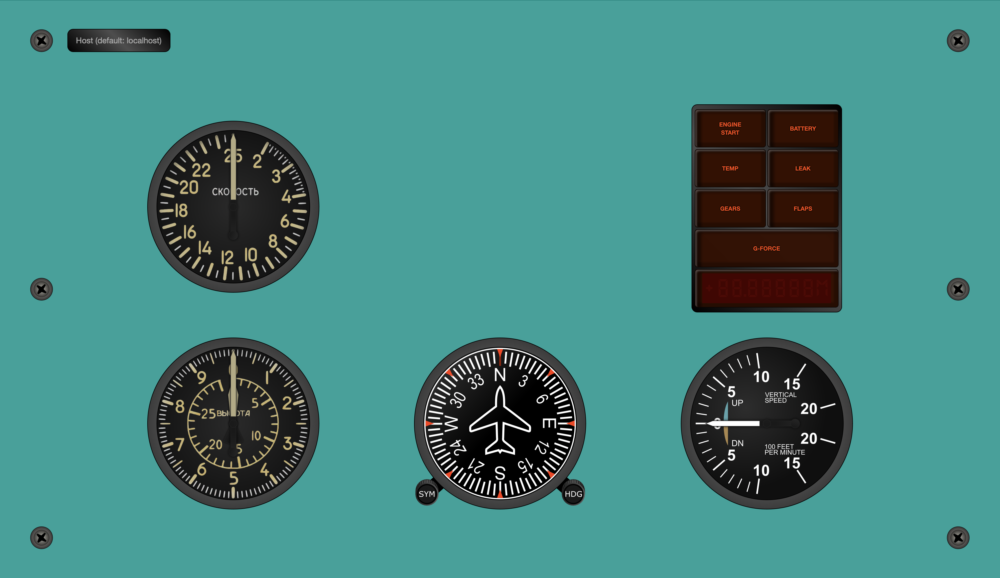

# War Thunder Meters (MiG-21 theme)

Ce plugin vous permet d'afficher des indicateurs de vol de haute qualité synchronisés avec War Thunder en utilisant des images HTML, CSS3, jQuery et SVG. Les méthodes facilitent vraiment la personnalisation et la mise en œuvre en temps réel. De plus, puisque toutes les images sont vectorielles svg, vous pouvez redimensionner les indicateurs de votre application sans aucune perte de qualité !

Les indicateurs actuellement pris en charge sont :

-   Vitesse (IAS)
-   Attitude
-   Altimètre
-   Coordonnateur de virage
-   Direction
-   Vitesse verticale

## Présentation

Voici un exemple de vol :

